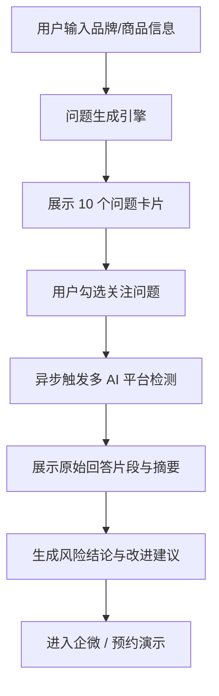

# NutriSKU 官网 AI 可见度诊断漏斗落地方案

## 1. 背景与目标

当前 [`/Users/karpsie/SkuGeo/nutrisku-web`](/Users/karpsie/SkuGeo/nutrisku-web) 已具备品牌展示、演示视频和产品手册能力，但整体仍偏“介绍型官网”。

本次新增能力的目标不是再增加一段产品说明，而是构建一个完整的转化闭环，让潜在客户在官网内直接经历以下过程：

1. 输入自己想宣传的品牌或商品信息。
2. 系统自动生成一批与该对象强相关的 GEO 检测问题。
3. 用户勾选自己最关心的问题，发起多 AI 平台检测。
4. 页面异步返回真实检测结果，暴露“AI 没有优先推荐自己”的风险。
5. 用户在焦虑和证据感并存的前提下，进入后续服务接入动作。

本方案第一阶段优先服务“免费诊断转化”，不引入账号门槛，不强制留资。

---

## 2. 本次已确认决策

### 2.1 目标平台

首批支持 3 个平台：

- 豆包
- Kimi
- DeepSeek

### 2.2 大模型开发基座

用于问题生成、结果摘要、风险结论生成的模型统一使用：

- Base URL: `http://ai-api.applesay.cn/v1`
- Model: `qwen3.5-plus`

说明：

- 该模型可同时处理文本和图片输入。
- 本项目第一阶段优先以文本为主，必要时为 AI 回答截图生成摘要。

### 2.3 结果展示原则

- 展示 AI 原始回答片段
- 同时调用 `qwen3.5-plus` 对片段做摘要和结论归纳
- 不收集联系方式
- 诊断执行采用异步返回
- 页面提供明显加载态，提示用户等待结果
- 服务接入区先保留：
  - 企微入口
  - 预约演示按钮

### 2.4 问题设计原则

沿用既有 GEO 问题设计方法论：

- 粗粒度
- 中粒度
- 细粒度

并保留以下约束：

- 粗粒度和中粒度优先不直呼目标品牌/商品全名
- 细粒度允许出现品牌名或更具体事实
- 问题必须像真实用户会问的问题，而不是内部评估语句
- 同一批问题必须覆盖品类发现、价格带、场景/人群、具体商品识别

---

## 3. 官网新增产品形态

## 3.1 页面定位

建议在首页新增一个核心 Section，命名暂定：

- 中文：`免费 AI 可见度诊断`
- 英文：`Free AI Visibility Audit`

推荐插入位置：

- `Hero` 后
- `Features` 前

原因：

- 直接承接首页首屏 CTA
- 用户在进入冗长介绍前就能开始互动
- 更适合作为商业转化主路径

### 3.2 整体漏斗



### 3.3 页面内子模块

建议拆成 4 个可复用 UI 模块：

1. `DiagnosisIntake`
   - 用户填写诊断对象
2. `QuestionSelector`
   - 展示并勾选问题
3. `AuditRunner`
   - 异步加载动画与检测进度
4. `AuditResults`
   - 结果卡片、焦虑结论、服务接入

---

## 4. 输入表单设计

## 4.1 设计目标

表单字段必须兼顾两点：

- 足够通用，适配品牌与商品
- 足够轻量，不要让用户在官网里填写完整商品资料

## 4.2 第一阶段字段

### 必填字段

- `entityType`
  - `product`
  - `brand`
- `name`
  - 诊断对象名称
- `category`
  - 所属品类

### 选填字段

- `url`
  - 官网、商品页或详情链接
- `priceBand`
  - 仅商品优先展示
- `sellingPoints`
  - 1-3 条核心卖点
- `targetAudience`
  - 目标人群
- `market`
  - 默认中国
- `notes`
  - 补充说明

### 推荐的商品示例

- 名称：`轻量防风通勤夹克`
- 品类：`夹克 / 男装`
- 价格带：`300-500 元`
- 核心卖点：`防风`、`耐穿`、`适合城市通勤`

### 推荐的品牌示例

- 名称：`某新消费护肤品牌`
- 品类：`护肤 / 功效护肤`
- 官网：`https://example.com`
- 目标人群：`敏感肌女性`

---

## 5. 问题生成设计

## 5.1 生成数量

单次默认生成约 10 个问题：

- 粗粒度：2 个
- 中粒度：4 个
- 细粒度：4 个

允许后续根据点击数据微调为 8-12 个区间。

## 5.2 问题结构

每个问题建议包含以下字段：

```json
{
  "id": "medium_2",
  "granularity": "medium",
  "question": "300到500元之间有哪些适合城市通勤的防风夹克？",
  "intent": "验证在价格带与场景限定下，AI 是否能返回目标商品",
  "risk_focus": "若未出现目标对象，说明该商品在高意图问题下可见度偏弱",
  "recommended": true
}
```

### 字段说明

- `id`: 问题唯一标识
- `granularity`: `coarse | medium | fine`
- `question`: 面向真实 AI 平台发问的话术
- `intent`: 内部解释，不一定默认展示给终端用户
- `risk_focus`: 当前问题意图暴露的风险点
- `recommended`: 是否为默认推荐勾选

## 5.3 前端展示方式

前端不直接展示 JSON 文本，而是展示问题卡片：

- 问题正文
- 粒度标签
- 可选的“为什么问这个”提示
- 勾选开关

默认行为：

- 自动勾选 3-5 个推荐问题
- 用户可以自行增减

## 5.4 问题生成模型职责

问题生成阶段由 `qwen3.5-plus` 完成，输入包括：

- 用户表单信息
- 官网或链接中可抽取的额外上下文
- 系统内置提示词模板

输出必须严格为 JSON。

---

## 6. 多 AI 平台检测设计

## 6.1 核心目标

不是简单展示“模型回答了什么”，而是让用户看见：

- 自己有没有被提到
- 竞品有没有被优先推荐
- 在哪些高意图问题上失去了曝光机会

## 6.2 检测执行方式

采用异步任务流：

1. 用户提交所选问题
2. 服务端创建一个 `audit job`
3. 后台依次调用豆包、Kimi、DeepSeek
4. 收集原始回答
5. 调用 `qwen3.5-plus` 做摘要、风险归纳和结果结构化
6. 前端轮询或 SSE 获取结果

### 前端体验要求

- 提交后立即进入加载状态
- 页面展示“正在检测豆包 / Kimi / DeepSeek”
- 支持逐平台完成态
- 最终整体切换到结果页

### 建议的进度文案

- `正在生成你的高价值检测问题...`
- `正在向 3 个 AI 平台发起检测...`
- `正在分析原始回答并生成结论...`
- `报告已生成`

## 6.3 平台检测层建议

官网仓库不应直接耦合重型平台适配逻辑。

推荐职责划分：

- `nutrisku-web`
  - 负责输入、交互、结果展示
- 独立诊断 API 层
  - 负责问题生成
  - 负责平台调用
  - 负责摘要和风险结论

### 说明

豆包、Kimi、DeepSeek 的接入方式未来可能并不统一：

- 部分平台可能有 API
- 部分平台可能需要浏览器自动化
- 部分平台可能需要专门的连接器层

因此本方案不把平台适配逻辑强耦合在 `nutrisku-web` 内部。

---

## 7. 结果页设计

## 7.1 结果页目标

结果页必须同时满足：

- 有真实证据感
- 有明确风险感
- 有下一步行动路径

## 7.2 结果页结构

### A. 顶部总览卡

展示总结论，例如：

- `在 9 个高意图问题中，3 个平台共 17 次提及竞品，仅 2 次提及你的商品。`
- `你的品牌在通用类问题中几乎没有自然出现。`
- `AI 更倾向于推荐同价格带、更高内容密度的竞品。`

### B. 平台结果卡

每个平台单独展示：

- 平台名称
- 问题列表
- 原始回答片段
- 摘要结论
- 是否提到目标对象
- 是否优先推荐竞品
- 识别出的主要竞品

### C. 风险聚合卡

由 `qwen3.5-plus` 根据所有平台结果生成统一结论：

- `当前可见度评级`
- `主要丢失场景`
- `最危险问题类型`
- `建议优先补强的内容方向`

### D. 服务接入区

第一阶段保留：

- 企微按钮
- 预约演示按钮

暂不强制收集表单联系方式。

---

## 8. 前后端职责边界

## 8.1 nutrisku-web 负责

- 漏斗式页面交互
- 表单收集
- 问题卡展示与选择
- 加载态和结果页
- 企微 / 预约演示转化组件

## 8.2 诊断服务负责

- 解析输入信息
- 问题生成
- 多 AI 平台检测
- 原始回答片段抽取
- `qwen3.5-plus` 摘要与风险归纳
- 返回统一结构化结果

## 8.3 推荐的 API 契约

### 创建诊断任务

`POST /api/visibility-audit`

请求体示例：

```json
{
  "entityType": "product",
  "name": "轻量防风通勤夹克",
  "category": "夹克",
  "priceBand": "300-500元",
  "sellingPoints": ["防风", "耐穿", "城市通勤"],
  "targetAudience": "一二线城市白领男性",
  "market": "CN"
}
```

返回：

```json
{
  "jobId": "audit_xxx",
  "status": "question_generating"
}
```

### 获取问题列表

`GET /api/visibility-audit/:jobId/questions`

### 提交用户选题

`POST /api/visibility-audit/:jobId/questions/confirm`

### 查询任务进度

`GET /api/visibility-audit/:jobId`

### 获取最终结果

`GET /api/visibility-audit/:jobId/result`

---

## 9. 结果数据结构建议

```json
{
  "jobId": "audit_xxx",
  "entity": {
    "entityType": "product",
    "name": "轻量防风通勤夹克",
    "category": "夹克"
  },
  "questions": [
    {
      "id": "medium_1",
      "granularity": "medium",
      "question": "300到500元之间有哪些适合通勤的防风夹克？"
    }
  ],
  "platforms": [
    {
      "platform": "kimi",
      "status": "completed",
      "answers": [
        {
          "questionId": "medium_1",
          "rawSnippet": "......",
          "summary": "回答主要推荐了 2 个竞品，没有提到目标商品。",
          "mentionsTarget": false,
          "competitors": ["竞品A", "竞品B"],
          "riskLevel": "high"
        }
      ]
    }
  ],
  "overallSummary": {
    "visibilityLevel": "low",
    "headline": "AI 在高意图问题中几乎没有自然推荐你的商品。",
    "keyRisks": [
      "通用类问题未被识别",
      "价格带竞争中被竞品压制",
      "场景类问题缺乏权威内容支撑"
    ],
    "suggestions": [
      "增加对比评测型内容",
      "优先布局价格带 + 使用场景问题",
      "强化品牌与核心卖点的共同出现频率"
    ]
  }
}
```

---

## 10. qwen3.5-plus 的具体职责

本次官网漏斗中，`qwen3.5-plus` 不是一个单用途模型，而是承担 3 类工作：

### 10.1 问题生成

输入：

- 用户表单
- 系统提示词

输出：

- 10 个结构化问题

### 10.2 回答摘要

输入：

- AI 平台原始回答文本
- 必要时的截图 OCR 文本或图片

输出：

- 回答摘要
- 是否提及目标对象
- 是否优先推荐竞品
- 竞品提取

### 10.3 风险结论生成

输入：

- 所有平台的结构化结果

输出：

- 总体诊断标题
- 焦虑感结论
- 改进方向建议

---

## 11. UI 与转化表达建议

## 11.1 整体风格

延续当前官网的高端深色调，但新增诊断区时建议更偏“仪表盘 + 风险扫描”视觉，而不是继续走纯宣传卡片风格。

关键词：

- 稍有压迫感
- 数据感
- 实时检测感
- 不花哨，但有明确行动张力

## 11.2 结果文案方向

结果文案不建议直接恐吓，但要明显传达风险：

- `AI 正在回答这些问题，但它没有优先回答你。`
- `你的潜在客户已经在提问，当前被看见的是别人。`
- `在你最关键的购买意图问题下，竞品仍是默认答案。`

这类文案适合作为结果页顶部的主标题或风险提示条。

---

## 12. 分阶段实施建议

## Milestone A：官网前端原型

目标：

- 在 `nutrisku-web` 内落地完整漏斗 UI
- 支持输入、问题展示、勾选、加载、结果页占位
- 先用本地 mock 数据驱动交互

完成标准：

- 首页出现新诊断区
- 交互闭环跑通
- 视觉风格和现有官网一致

## Milestone B：问题生成真实接入

目标：

- 接入 `qwen3.5-plus`
- 用真实输入生成粗中细问题
- 替换前端 mock 问题

完成标准：

- 输入不同对象时，问题能明显变化
- 输出保持结构化稳定

## Milestone C：多平台检测接入

目标：

- 打通豆包、Kimi、DeepSeek 的检测能力
- 支持异步任务和结果回显
- 接入摘要与总体结论

完成标准：

- 能基于用户所选问题返回真实平台结果
- 结果页完成真实落地

## Milestone D：服务接入完善

目标：

- 接入企微入口
- 接入预约演示按钮
- 加入转化埋点和点击统计

完成标准：

- 用户完成诊断后可立即进入商务动作

---

## 13. 已知风险与实现注意事项

## 13.1 平台接入不确定性

豆包、Kimi、DeepSeek 的调用方式可能不同，因此检测层要预留适配器结构，避免把调用逻辑写死在官网代码里。

## 13.2 结果时延

由于存在：

- 问题生成
- 多平台调用
- 摘要和归纳

单次完整任务可能需要数十秒。第一阶段必须做好异步加载和用户等待管理。

## 13.3 结果稳定性

第三方 AI 平台的回答可能会波动，因此：

- 需要保留原始回答片段
- 不应只展示结论
- 摘要逻辑要尽量可解释

## 13.4 输入质量差异

用户输入可能很短或很模糊，因此问题生成提示词中必须加入兜底逻辑，避免生成过于泛泛的问题。

---

## 14. 推荐的下一步

本方案确认后，建议严格按以下顺序推进：

1. 先做 `Milestone A`
   - 只改 `nutrisku-web`
   - 不引入真实平台调用
2. 再做 `Milestone B`
   - 先让问题生成真实可用
3. 最后做 `Milestone C`
   - 接入豆包 / Kimi / DeepSeek 的真实检测

这样可以先把官网的转化交互和视觉体验打稳，再逐步填入真实能力，避免一开始就被外部平台接入细节拖慢。
